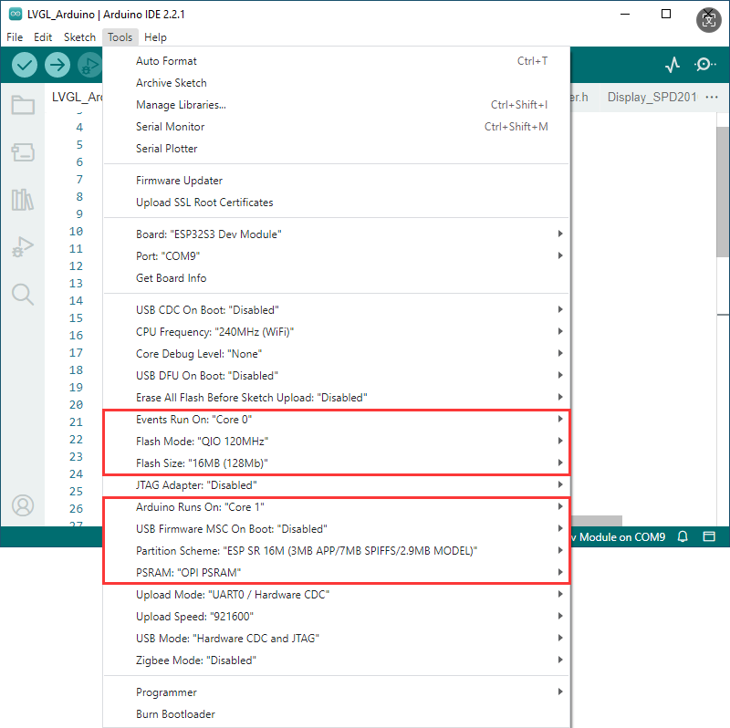

[中文版：](./README_CN.md)

English: 	(Please watch in full screen to avoid typeset clutter caused by line breaks !!!!!)

&nbsp;	(Please watch in full screen to avoid typeset clutter caused by line breaks !!!!!)

&nbsp;	(Please watch in full screen to avoid typeset clutter caused by line breaks !!!!!)

&nbsp;	Arduino 		    Use under Arduino IDE software

&nbsp;			example 		   Store examples (Direct compilable)

&nbsp;			libraries 		   Store library files (This folder is only used in Arduino environment!)

&nbsp;				       Note: esp32 by Espressif Systems must be 3.2.0 or above!(The current example is based on V3.2.0 programming)

Arduino example Tools configuration：

&nbsp;	ESP-IDF			Used under VScode software. The samples stored in this folder can be compiled directly. When VScode selects the project, it is noted that it is not selected to ESP-IDF, but to the project folder under ESP-IDF. Normally, the name  is product-Test.

&nbsp;				      Note: ESP-IDF must be 5.4.0 or above

&nbsp;	Firmware 		  Test firmware (burn at "flash\_download\_tool\_3.9.5" at 0x00. Remember to check the previous box)

&nbsp;	Note: If the compilation succeeds the first time and the compilation fails during subsequent tests, decompress the folder again and compile the new file

For more product information, please refer to the link:

[https://www.waveshare.net/shop/ESP32-S3-DualEye-LCD-1.28.htm](https://www.waveshare.net/shop/ESP32-S3-DualEye-LCD-1.28.htm)
